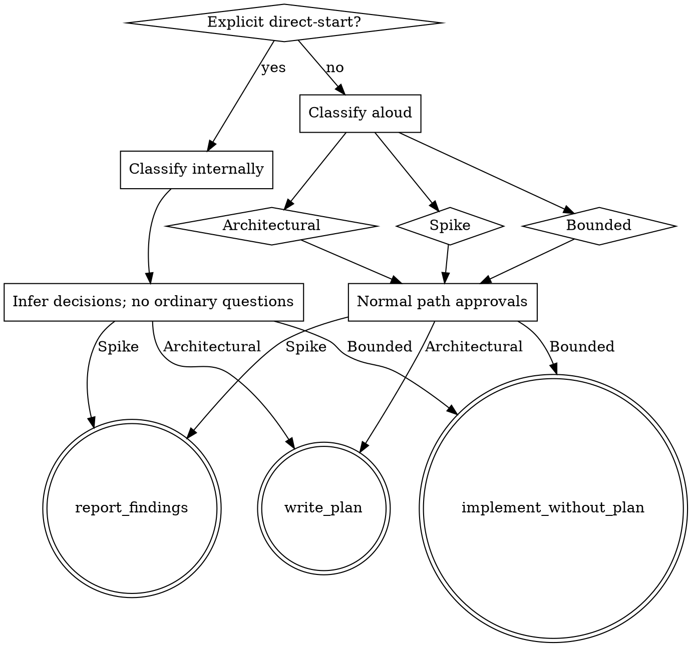

# Brainstorming Execution Routing Implementation Plan

> **For agentic workers:** REQUIRED SUB-SKILL: Use superpowers:subagent-driven-development (recommended) or superpowers:executing-plans to implement this plan task-by-task. Steps use checkbox (`- [ ]`) syntax for tracking.

**Goal:** Integrate upstream Superpowers v6.3.0 Brainstorming into the fork while preserving explicit direct-start autonomy, one-pass plan review, and the fork's execution handoff policy.

**Architecture:** Treat upstream v6.3.0 Brainstorming and Visual Companion as the normal-mode implementation, then add one compact direct-start routing layer at the Brainstorming interface. Keep plan construction, one-pass independent review, and executor handoff local to `writing-plans`. After all skill edits are complete, validate routing behavior with fresh read-only subagents.

**Tech Stack:** Markdown Agent Skills, shell/Node Visual Companion, npm brainstorm-server tests, fresh general-purpose subagents

**Testing:** Standard — validate behavior with fresh read-only subagents after all skill edits are complete.

**Spec:** `docs/superpowers/specs/2026-08-20-brainstorming-execution-routing-design.md`

## Global Constraints

- Upstream v6.3.0 `Spike / Bounded / Architectural` Brainstorming is the source of truth for normal interaction.
- Direct-start activates only from explicit equivalents of “start directly”, “do not ask”, “handle it yourself”, or “continue through completion”; ordinary task verbs do not activate it.
- Direct-start continues end-to-end without ordinary clarification, approval, execution-choice, or code-review questions, but stops for destructive, security-sensitive, consent-requiring external, permission, or fatally underspecified blockers.
- Brainstorming decides only among `report_findings`, `implement_without_plan`, and `write_plan`; `writing-plans` owns plan review and executor handoff.
- There is no `continuous-execution` state.
- Normal Architectural mode keeps the upstream just-in-time Visual Companion offer as a standalone message; direct-start neither offers nor opens it.
- The upstream Visual Companion guide, scripts, and brainstorm-server tests are authoritative as one feature unit.
- Preserve Standard/TDD selection, the unstaged/uncommitted policy, the pre-existing index, and all three normal execution choices in `writing-plans`.
- Plan review dispatches exactly one read-only reviewer; findings trigger fixes plus self-review, never an automatic second reviewer.
- Validate skill behavior only after the Brainstorming and writing-plans skill edits are complete, using fresh read-only subagents.
- Do not add dependencies to the Superpowers repository.
- Leave all plan-produced changes unstaged and uncommitted; do not run `git add` or `git commit`.

---

### Task 1: Synchronize the authoritative Visual Companion feature unit

**Files:**
- Modify: `skills/brainstorming/visual-companion.md:84-91`
- Verify: `skills/brainstorming/scripts/frame-template.html`
- Verify: `skills/brainstorming/scripts/helper.js`
- Verify: `skills/brainstorming/scripts/server.cjs`
- Verify: `skills/brainstorming/scripts/start-server.sh`
- Verify: `skills/brainstorming/scripts/stop-server.sh`
- Verify: `tests/brainstorm-server/`

**Interfaces:**
- Consumes: upstream v6.3.0 source at `/Users/hb/Documents/open source/superpowers`
- Produces: byte-equivalent Visual Companion guide, scripts, and tracked brainstorm-server tests

**Testing:** Standard — validate behavior with fresh read-only subagents after all skill edits are complete.

- [ ] **Step 1: Replace the Copilot CLI guidance with upstream v6.3.0**

Use this exact content:

````markdown
**Copilot CLI:**
```bash
# Start it with Copilot CLI's non-blocking/background shell mechanism so the
# server survives across turns. Keep --foreground so the harness, not the
# script, owns backgrounding. The launcher is a .sh, so invoke it via bash
# (on Windows, call Git Bash's bash.exe from the PowerShell tool).
bash scripts/start-server.sh --project-dir /path/to/project --open --foreground
```
````

- [ ] **Step 2: Verify the entire feature unit against upstream**

Run this from the fork root; it compares only tracked files and therefore excludes `node_modules/`:

```bash
for file in \
  skills/brainstorming/visual-companion.md \
  skills/brainstorming/scripts/frame-template.html \
  skills/brainstorming/scripts/helper.js \
  skills/brainstorming/scripts/server.cjs \
  skills/brainstorming/scripts/start-server.sh \
  skills/brainstorming/scripts/stop-server.sh \
  $(git ls-files tests/brainstorm-server); do
  cmp -s "$file" "/Users/hb/Documents/open source/superpowers/$file" || {
    echo "DIFF: $file"
    exit 1
  }
done
```

Expected: the guide, five scripts, package files, and ten tracked test programs are byte-equivalent to upstream v6.3.0.

- [ ] **Step 3: Run the brainstorm-server suite**

Run:

```bash
cd /Users/hb/Documents/Mycode/superpowers/tests/brainstorm-server
npm test
```

Expected: all Node and shell lifecycle, auth, WebSocket, branding, helper, browser-launcher, and server tests pass.

- [ ] **Final Step: Read the Task files and verify the implementation**

Read the complete guide and every file that differs from the fork's starting state. Run:

```bash
cd /Users/hb/Documents/Mycode/superpowers
git diff --check -- skills/brainstorming/visual-companion.md
```

Expected: the Copilot instructions invoke the `.sh` through `bash`, the complete feature unit matches upstream, and the whitespace check passes.

---

### Task 2: Replace Brainstorming with the upstream router plus direct-start

**Files:**
- Modify: `skills/brainstorming/SKILL.md`
- Delete: `skills/brainstorming/after-the-design.md`
- Delete: `skills/brainstorming/anti-rationalizations.md`

**Interfaces:**
- Consumes: explicit user wording plus repository context
- Produces: exactly `report_findings`, `implement_without_plan`, or `write_plan`; `write_plan` passes the normal/direct-start state to `writing-plans` and terminates Brainstorming

**Testing:** Standard — validate behavior with fresh read-only subagents after all skill edits are complete.

- [ ] **Step 1: Start from upstream v6.3.0 Brainstorming**

Replace the fork body with:

`/Users/hb/Documents/open source/superpowers/skills/brainstorming/SKILL.md`

Retain the upstream Three Paths, Red Flags, path checklists, one-way ratchet, process guidance, and complete Visual Companion section.

Replace upstream's unconditional Bounded-path phrase “TDD applies” with:

```markdown
Implementation proceeds through the normal development workflow. Select TDD
only when the human partner explicitly requested it or the approved
requirements require it; otherwise use Standard testing.
```

- [ ] **Step 2: Add the compact direct-start contract after the hard gate**

```markdown
## Direct-Start

Direct-start is explicit end-to-end authorization. Activate it only when the
human partner says an equivalent of "start directly", "do not ask", "handle it
yourself", or "continue through completion". Ordinary task verbs such as
"implement", "fix", or "add" do not activate it.

When active:

1. Classify the path internally; do not ask the partner to approve it.
2. Skip ordinary clarification, design-approval, spec-approval,
   plan-execution, and code-review questions.
3. Infer reasonable assumptions and report only material ones at completion.
4. Upgrade the path when hidden complexity appears without leaving
   direct-start.
5. For Architectural work, write and self-review the spec and plan as needed.
   `writing-plans` still performs its one independent plan review.
6. Pass direct-start to `writing-plans`; that skill owns the one-pass plan
   review, executor selection, and continuation.
7. Do not offer or automatically open the Visual Companion.

Direct-start stops only for an irreversible or destructive operation, a
security-sensitive operation, an external side effect that conventionally
requires consent, missing credentials or permissions, or a request so
underspecified that every implementation would be a guess.
```

- [ ] **Step 3: Define the three terminal states and mode-specific handoff**

```markdown
## Terminal Routing

Brainstorming has exactly three terminal states:

1. `report_findings` — Spike reports its recommendation.
2. `implement_without_plan` — approved normal Bounded work, or direct-start
   Bounded work, enters the normal development workflow without a plan.
3. `write_plan` — Architectural work invokes `superpowers:writing-plans`.

In normal mode, `writing-plans` handles `write_plan` by ending at the reviewed
plan's three execution choices: Subagent-Driven, Inline Execution, or Do
Nothing. Implementation starts only after the human partner selects one.

`write_plan` is a Brainstorming terminal state. It invokes
`superpowers:writing-plans` with the normal/direct-start state and does not
choose an executor. `writing-plans` owns the review and mode-specific handoff.
```

- [ ] **Step 4: Adapt the upstream gate and add the direct-start checklist**

Replace the upstream hard gate with:

```markdown
<HARD-GATE>
Unless direct-start is active, do NOT invoke any implementation skill, write
code, scaffold a project, or take implementation action until you have told
your human partner what you intend and they have approved it. Every normal path
keeps this approval gate; only explicit direct-start bypasses it.
</HARD-GATE>
```

Add this checklist beside the three upstream normal-path checklists:

```markdown
**Direct-start:**
1. **Explore project context** — enough to classify and identify blockers
2. **Classify internally** — Spike, Bounded, or Architectural; never downgrade
3. **Infer decisions** — record only material assumptions for the final report
4. **Route internally** — report findings, implement without a plan, or enter
   `write_plan`, which passes the state to `writing-plans`
5. **Continue automatically** — pass direct-start to `writing-plans`, which
   selects the safest executor after review
6. **Self-review and verify** — continue through risk-appropriate review and
   completion reporting
```

- [ ] **Step 5: Replace the process graph with one router**



Remove every reference to `continuous-execution`, completion-time review consent, `after-the-design.md`, and `anti-rationalizations.md`.

- [ ] **Step 6: Preserve the fork's uncommitted-change policy**

In the upstream Architectural checklist and documentation section, save the spec to `docs/superpowers/specs/YYYY-MM-DD-<topic>-design.md` but do not instruct the agent to commit it. Keep the user review gate in normal mode; direct-start self-reviews and continues without asking.

- [ ] **Step 7: Keep Visual Companion upstream-exact in normal mode**

Retain the upstream offer verbatim and add only this mode predicate before the section:

```markdown
This section applies only to normal Architectural mode. Direct-start neither
offers nor automatically opens the Visual Companion.
```

- [ ] **Step 8: Delete obsolete fork-only routing references**

Delete `skills/brainstorming/after-the-design.md` and `skills/brainstorming/anti-rationalizations.md` after confirming `skills/brainstorming/SKILL.md` no longer links to them.

- [ ] **Final Step: Read the Task files and verify the implementation**

Read `skills/brainstorming/SKILL.md` in full. Verify one interface, one path ratchet, exactly three terminal states, no duplicate post-design router, and no deleted-file references. Run:

```bash
cd /Users/hb/Documents/Mycode/superpowers
git diff --check -- skills/brainstorming
```

Expected: no whitespace errors and no references to removed routing files or `continuous-execution`. Do not launch behavior-validation subagents yet; Task 3 must finish first.

---

### Task 3: Add one-pass read-only plan review to writing-plans

**Files:**
- Modify: `skills/writing-plans/SKILL.md`
- Modify: `skills/writing-plans/plan-document-reviewer-prompt.md`

**Interfaces:**
- Consumes: a complete self-reviewed plan plus either a spec path or explicit no-spec requirements authority
- Produces: exactly one read-only reviewer result, controller fixes plus self-review when needed, then normal three-way handoff or direct-start executor continuation

**Testing:** Standard — validate behavior with fresh read-only subagents after all skill edits are complete.

- [ ] **Step 1: Add an explicit spec/no-spec authority slot to the plan header**

After `**Testing:**`, add:

```markdown
**Spec:** [exact path, or `none — requirements: <approved requirements stated once>`]
```

Plans without a spec cite the approved conversational requirements once in this header; tasks inherit them and do not fabricate or repeat a spec.

- [ ] **Step 2: Add the single-review phase after Self-Review**

```markdown
## Plan Review

After the complete plan passes Self-Review:

1. Dispatch exactly one read-only general-purpose plan reviewer using
   `plan-document-reviewer-prompt.md`.
2. Give it the plan path and exactly one requirements authority:
   - the spec path, when a spec exists; or
   - `No spec exists; use the approved requirements in the plan header and the
     plan's Global Constraints.`
3. If it reports implementation-blocking findings, fix them in the plan and
   repeat Self-Review.
4. Do not dispatch another reviewer by default. Continue to Execution Handoff
   after the controller's fixes and self-review.

The reviewer is read-only. The controller remains responsible for every plan
edit.
```

- [ ] **Step 3: Preserve testing and working-tree policies**

Keep the existing Standard/TDD selection rules, exact per-task testing label, mandatory final file-reading step, non-mutating diagnostics, unstaged and uncommitted changes, and pre-existing index preservation unchanged.

- [ ] **Step 4: Preserve and qualify the three execution choices**

Keep the existing three-option handoff verbatim for normal mode. Add:

```markdown
If Brainstorming recorded direct-start, do not show the choices. Select the
safest suitable executor after Plan Review and continue: prefer
Subagent-Driven for independent tasks with available subagents; otherwise use
Inline Execution.
```

- [ ] **Step 5: Replace the reviewer prompt with a read-only optional-spec contract**

```markdown
# Plan Document Reviewer Prompt Template

Use this template for the single independent review after the complete plan has
passed the controller's self-review.

**Purpose:** Report only implementation-blocking defects in completeness,
requirements alignment, task decomposition, interface consistency, or
buildability.

**Plan to review:** `[PLAN_FILE_PATH]`

**Authority:** Supply exactly one:
- `Spec: [SPEC_FILE_PATH]`
- `No spec exists; use the approved requirements in the plan header and the
  plan's Global Constraints.`

**Read-only:** Do not edit the plan or any project file.

## Output

## Plan Review

**Status:** Approved | Issues Found

**Implementation-blocking issues:**
- [Task X, Step Y]: [specific defect] — [how it would block or misdirect implementation]

Return `Approved` with an empty issue list when no implementation-blocking
defect exists. Do not report style preferences or optional improvements as
findings.
```

- [ ] **Final Step: Read the Task files and verify the implementation**

Read both writing-plans files in full. Check that the reviewer interface is optional-spec, read-only, findings-only, and single-pass; check that testing modes and working-tree policy did not drift. Run:

```bash
cd /Users/hb/Documents/Mycode/superpowers
git diff --check -- \
  skills/writing-plans/SKILL.md \
  skills/writing-plans/plan-document-reviewer-prompt.md
```

Expected: no whitespace errors and all interface terms match exactly. Both skill-editing tasks are now complete, so Task 4 may begin subagent validation.

---

### Task 4: Validate completed skills with fresh subagents

**Files:**
- Verify: `skills/brainstorming/SKILL.md`
- Verify: `skills/brainstorming/visual-companion.md`
- Verify: `skills/brainstorming/scripts/`
- Verify: `skills/writing-plans/SKILL.md`
- Verify: `skills/writing-plans/plan-document-reviewer-prompt.md`
- Verify: `tests/brainstorm-server/`

**Interfaces:**
- Consumes: completed Task 1–3 files
- Produces: independent read-only findings covering all fourteen Required Behavior Tests, plus passing repository-local script tests and upstream equality checks

**Testing:** Standard — post-implementation verification uses fresh read-only subagents, as explicitly requested by the human partner.

- [ ] **Step 1: Dispatch a normal-mode routing validator**

Dispatch one fresh read-only general-purpose subagent with this exact prompt:

```text
Work read-only in /Users/hb/Documents/Mycode/superpowers.

Read:
- docs/superpowers/specs/2026-08-20-brainstorming-execution-routing-design.md
- skills/brainstorming/SKILL.md
- skills/brainstorming/visual-companion.md
- skills/writing-plans/SKILL.md
- skills/writing-plans/plan-document-reviewer-prompt.md

Validate normal-mode behavior for these cases:
1. "Implement a Clear completed button beside the existing task filters."
2. A per-project notification-preferences request that becomes Architectural.
3. A conceptual Architectural discussion that never reaches a visual question.
4. An Architectural discussion whose first visual decision is dashboard layout.

Check that "Implement" alone does not activate direct-start; Bounded work waits
for design approval; Architectural work reaches an approved spec and exactly
one reviewed plan, then stops at Subagent-Driven / Inline Execution / Do
Nothing; implementation does not start before a choice; and the Visual
Companion is offered only immediately before the first genuinely visual
question, as a standalone upstream-exact message.

Do not edit files. Return only:
- PASS, or
- FAIL followed by implementation-blocking findings with file and line.
```

Expected: `PASS`. This covers Required Behavior Tests 1–3, 6, 11, and 12.

- [ ] **Step 2: Dispatch a direct-start routing validator**

Dispatch a second fresh read-only general-purpose subagent with this exact prompt:

```text
Work read-only in /Users/hb/Documents/Mycode/superpowers.

Read the approved design and the completed brainstorming and writing-plans
skills. Validate these explicit direct-start cases:
1. A bounded Clear completed button request.
2. A notification toggle that repository context upgrades from Bounded to
   Architectural because it needs storage, sync, migration, and conflict rules.
3. A production database deletion.
4. Publishing a production API key.
5. A production deployment with missing credentials.

Check that direct-start asks no ordinary clarification, design-approval,
spec-approval, execution-choice, or code-review question; Bounded work enters
implementation without a plan; Architectural work may create and review a plan
but automatically selects an executor after exactly one plan review; hidden
complexity does not disable direct-start; destructive, security-sensitive, and
permission-blocked operations stop safely; and Visual Companion is neither
offered nor opened.

Do not edit files. Return only:
- PASS, or
- FAIL followed by implementation-blocking findings with file and line.
```

Expected: `PASS`. This covers Required Behavior Tests 4, 5, 9, 10, and 13.

- [ ] **Step 3: Dispatch a plan-review contract validator**

Dispatch a third fresh read-only general-purpose subagent with this exact prompt:

```text
Work read-only in /Users/hb/Documents/Mycode/superpowers.

Read the approved design, skills/writing-plans/SKILL.md, and
skills/writing-plans/plan-document-reviewer-prompt.md.

Validate both authorities:
1. A plan with an approved spec path.
2. A plan with no spec and approved requirements recorded once in its header.

Also validate a reviewer finding where Task 1 produces
loadPreferences(projectId): Preference[] but Task 2 consumes
loadPreferences(projectId): Promise<Preference[]>.

Check that exactly one read-only reviewer is dispatched; it receives exactly
one requirements authority and reports only implementation-blocking findings;
the controller fixes the mismatch and repeats Self-Review without dispatching a
second reviewer; normal mode preserves exactly three execution choices; and
direct-start skips those choices and continues with a suitable executor.

Do not edit files. Return only:
- PASS, or
- FAIL followed by implementation-blocking findings with file and line.
```

Expected: `PASS`. This covers Required Behavior Tests 2, 5–8.

- [ ] **Step 4: Dispatch an ownership and source-integrity validator**

Dispatch a fourth fresh read-only general-purpose subagent with this exact prompt:

```text
Work read-only in /Users/hb/Documents/Mycode/superpowers.

Compare the approved design with:
- skills/brainstorming/SKILL.md
- skills/brainstorming/visual-companion.md
- skills/brainstorming/scripts/
- skills/writing-plans/SKILL.md
- skills/writing-plans/plan-document-reviewer-prompt.md
- /Users/hb/Documents/open source/superpowers/skills/brainstorming/
- /Users/hb/Documents/open source/superpowers/tests/brainstorm-server/

Check that Brainstorming owns only path classification and its three terminal
routes; writing-plans alone owns plan review and executor handoff; there is no
continuous-execution state or duplicate post-design router; deleted fork-only
files have no remaining references; and the Visual Companion guide, scripts,
and brainstorm-server tests are upstream v6.3.0 exact except for the explicitly
approved Brainstorming routing changes outside that feature unit.

Do not edit files. Return only:
- PASS, or
- FAIL followed by implementation-blocking findings with file and line.
```

Expected: `PASS`. This covers Required Behavior Test 14 and the module-ownership constraints.

- [ ] **Step 5: Fix subagent findings and revalidate only affected surfaces**

If any validator reports `FAIL`, inspect each finding against the approved design. Fix only confirmed implementation-blocking defects, repeat the controller's file-reading self-review, then dispatch one fresh replacement validator using the same prompt as the failed validator. Do not ask the original validator to review again and do not broaden scope.

Expected: all four validation surfaces reach `PASS`.

- [ ] **Step 6: Run repository-local Visual Companion tests**

Run:

```bash
cd /Users/hb/Documents/Mycode/superpowers/tests/brainstorm-server
npm test
```

Expected: the full suite passes with no failed Node or shell test.

- [ ] **Step 7: Verify authoritative upstream equality**

Run:

```bash
cd /Users/hb/Documents/Mycode/superpowers
for file in \
  skills/brainstorming/visual-companion.md \
  skills/brainstorming/scripts/frame-template.html \
  skills/brainstorming/scripts/helper.js \
  skills/brainstorming/scripts/server.cjs \
  skills/brainstorming/scripts/start-server.sh \
  skills/brainstorming/scripts/stop-server.sh \
  $(git ls-files tests/brainstorm-server); do
  cmp -s "$file" "/Users/hb/Documents/open source/superpowers/$file" || exit 1
done
```

Expected: no difference in the authoritative feature unit.

- [ ] **Step 8: Check the working tree without staging**

Run:

```bash
cd /Users/hb/Documents/Mycode/superpowers
git status --short
git diff --check
```

Expected: only the spec, plan, intended skill/guide/deletion changes appear; no files are staged.

- [ ] **Final Step: Read all changed files and verify the implementation**

Read every modified or created file listed in Tasks 1–4, plus directly affected references. Check each of the fourteen Required Behavior Tests against the implementation and the four subagent reports. Confirm the plan-review seam is owned only by `writing-plans`, the direct-start seam is owned only by Brainstorming, and Visual Companion remains upstream-exact. Re-run any focused repository-local test affected by a self-review fix.

Expected: every spec requirement has implementation and post-change subagent coverage, no placeholder or obsolete reference remains, all relevant verification passes, and the index remains unchanged.
