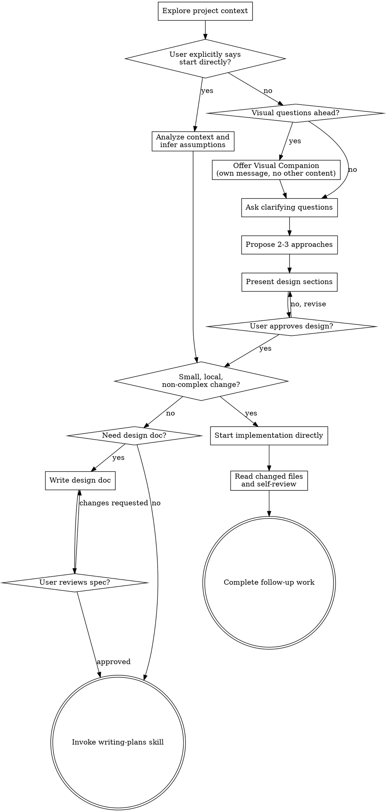

# Brainstorming Ideas Into Designs

Help turn ideas into designs and, when needed, specs through natural collaborative dialogue.

Default path: explore the current project context, ask questions one at a time, then present a design and get approval. Direct-start is an explicit opt-out, not the default.

<HARD-GATE>
Unless the user explicitly authorizes direct-start, do NOT invoke any implementation skill, write any code, scaffold any project, or take any implementation action until you have presented a design and the user has approved it. This applies to EVERY project regardless of perceived simplicity.
</HARD-GATE>

## Direct-Start Override

Direct-start mode requires an explicit user override that you can quote from the user's message. Match the user's actual language; semantic equivalents in any language count.

- Task verbs such as "implement", "fix", "update", or "add" describe **what** to do; they do **not** waive questioning or design approval
- Valid overrides sound like "start directly", "don't ask follow-up questions", "skip the design", "just do it", or "continue through completion", or clear equivalents in the user's language
- If you cannot point to the user's explicit override, stay on the default path
- In direct-start mode, infer reasonable constraints from context, state only material assumptions, and ask at most the minimum blocking question
- Do not treat size, confidence, or file references as implied permission to skip brainstorming

## Anti-Pattern: "This Is Too Simple To Need A Design"

By default, every project goes through this process. A todo list, a single-function utility, a config change — all of them. "Simple" projects are where unexamined assumptions cause the most wasted work. The design can be short (a few sentences for truly simple projects), but you MUST still present it and get approval.

For pressure cases, rationalizations, and self-checks, see [anti-rationalizations.md](anti-rationalizations.md).

## Checklist

You MUST create a task for each of these items and complete them in order. Skip dialogue-only items when direct-start is active, and skip design-doc-only items when no written spec is needed.

1. **Explore project context** — check the relevant files, docs, and existing patterns
2. **Check for explicit direct-start** — only switch if you can quote the user's override or a clear equivalent in their language; offer visual companion in its own message only when visual questions are likely
3. **Ask clarifying questions** — in the default path, ask one at a time until purpose, constraints, and success criteria are clear
4. **Propose approaches** — in the default path, present 2-3 options with trade-offs and a recommendation
5. **Present design** — in the default path, present the design in sections and get approval
6. **Judge complexity** — decide whether the work is small enough to skip both durable planning and a written spec, or complex enough to need a written design doc and/or `superpowers:writing-plans`
7. **Write design doc when needed** — save the validated design only when it adds durable value, then self-review it for placeholders, contradictions, scope drift, and ambiguity
8. **User reviews written spec** — if you wrote a design doc, stop and wait for the user's approval before planning or follow-up work
9. **Route into follow-up work** — if the work is small, local, and non-complex, continue directly from the approved design on the default path, or directly after direct-start context analysis on the direct-start path, and later follow the closing discipline from `superpowers:executing-plans`; otherwise use `superpowers:writing-plans`

## Process Flow

**Routing depends on complexity, not preference alone.** In direct-start mode, make that judgment from context yourself. Otherwise, make it after design approval. If you are genuinely unsure whether the work is still "small", bias toward `superpowers:writing-plans`. On the small direct path, borrow the final self-review discipline from `superpowers:executing-plans`; do not invoke that skill unless a written implementation plan actually exists.

## The Process

**Understanding the idea:**

- Check out the current project state first (files, docs, recent commits)
- Before asking detailed questions, assess scope: if the request describes multiple independent subsystems (e.g., "build a platform with chat, file storage, billing, and analytics"), flag this immediately. Don't spend questions refining details of a project that needs to be decomposed first.
- If the request spans multiple subsystems or a cross-cutting feature bundle, decompose it into sub-projects before implementation planning, even in direct-start mode: what are the independent pieces, how do they relate, what order should they be built? Then brainstorm the first sub-project through the normal design flow. Each sub-project gets its own design → optional spec → plan → implementation cycle.
- In direct-start mode, infer the likely intent from context instead of running the normal questioning loop
- For appropriately-scoped projects on the default path, ask questions one at a time to refine the idea
- Prefer multiple choice questions when possible, but open-ended is fine too
- Only one question per message - if a topic needs more exploration, break it into multiple questions
- Focus on understanding: purpose, constraints, success criteria

**Exploring approaches:**

- In the default path, propose 2-3 different approaches with trade-offs
- Present options conversationally with your recommendation and reasoning
- Lead with your recommended option and explain why

**Presenting the design:**

- In the default path, once you believe you understand what you're building, present the design
- Scale each section to its complexity: a few sentences if straightforward, up to 200-300 words if nuanced
- In the default path, ask after each section whether it looks right so far
- Cover: architecture, components, data flow, error handling, testing
- Be ready to go back and clarify if something doesn't make sense

**Complexity routing:**

- After design approval in the default path, or immediately after context analysis in direct-start mode, make an explicit complexity judgment
- Small, local, low-risk work skips both the written design doc and `superpowers:writing-plans`
- Cross-cutting, high-risk, multi-step, or rollback-sensitive work should use `superpowers:writing-plans`
- For larger or uncertain work, `superpowers:writing-plans` is the default next step; a design doc is optional and never a prerequisite for that transition
- If a larger design was approved in chat, you may move straight into `superpowers:writing-plans`; do not create a spec afterward unless it adds durable value
- Write a design doc only when it adds durable value; do not create one just because brainstorming happened

**Design for isolation and clarity:**

- Break the system into smaller units that each have one clear purpose, communicate through well-defined interfaces, and can be understood and tested independently
- For each unit, you should be able to answer: what does it do, how do you use it, and what does it depend on?
- Can someone understand what a unit does without reading its internals? Can you change the internals without breaking consumers? If not, the boundaries need work.
- Smaller, well-bounded units are also easier for you to work with - you reason better about code you can hold in context at once, and your edits are more reliable when files are focused. When a file grows large, that's often a signal that it's doing too much.

**Working in existing codebases:**

- Explore the current structure before proposing changes. Follow existing patterns.
- Where existing code has problems that affect the work (e.g., a file that's grown too large, unclear boundaries, tangled responsibilities), include targeted improvements as part of the design - the way a good developer improves code they're working in.
- Don't propose unrelated refactoring. Stay focused on what serves the current goal.

## After the Design

For design-doc writing, spec self-review, user review gating, and post-approval implementation routing, see [after-the-design.md](after-the-design.md).

## Key Principles

- **One question at a time** - Don't overwhelm with multiple questions when questions are actually needed
- **Multiple choice preferred** - Easier to answer than open-ended when possible
- **YAGNI ruthlessly** - Remove unnecessary features from all designs
- **Explore alternatives** - In the default path, propose 2-3 approaches before settling
- **Incremental validation** - In the default path, present design and get approval before implementation
- **Be flexible** - Go back and clarify when something doesn't make sense
