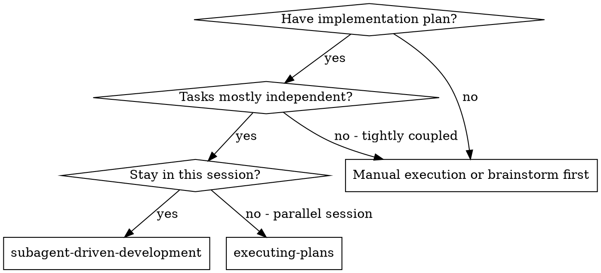
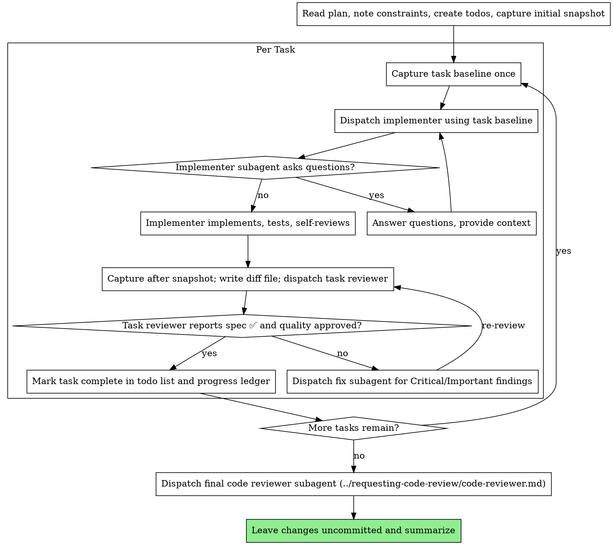

# Subagent-Driven Development

Execute a plan by dispatching a fresh implementer subagent per task, reviewing each task through isolated worktree snapshots, and running a broad whole-worktree review at the end. All implementation changes remain unstaged and uncommitted.

**Why subagents:** You delegate tasks to specialized agents with isolated context. By precisely crafting their instructions and context, you ensure they stay focused and succeed at their task. They should never inherit your session's context or history — you construct exactly what they need. This also preserves your own context for coordination work.

**Core principle:** Fresh subagent per task + snapshot-isolated task review (spec + quality) + broad final review = high quality without mutating Git history

**Narration:** between tool calls, narrate at most one short line — the
ledger and the tool results carry the record.

**Continuous execution:** Do not pause to check in with your human partner between tasks. Execute all tasks from the plan without stopping. The only reasons to stop are: BLOCKED status you cannot resolve, ambiguity that genuinely prevents progress, or all tasks complete. "Should I continue?" prompts and progress summaries waste their time — they asked you to execute the plan, so execute it.

## When to Use



**vs. Executing Plans (parallel session):**
- Same session (no context switch)
- Fresh subagent per task (no context pollution)
- Review after each task (spec compliance + code quality), broad review at the end
- Faster iteration (no human-in-loop between tasks)

## The Process



## Pre-Flight Plan Review

Before dispatching Task 1, scan the plan once for conflicts:

- tasks that contradict each other or the plan's Global Constraints
- anything the plan explicitly mandates that the review rubric treats as a
  defect (a test that asserts nothing, verbatim duplication of a logic block)

Present everything you find to your human partner as one batched question —
each finding beside the plan text that mandates it, asking which governs —
before execution begins, not one interrupt per discovery mid-plan. If the
scan is clean, proceed without comment. The review loop remains the net for
conflicts that only emerge from implementation.

## Snapshot Contract

The controller owns all Git inspection. Implementers and fixers only edit,
test, self-review, and report:

1. At workflow start, capture `INITIAL_SNAPSHOT` with
   `scripts/worktree-snapshot`.
2. Immediately before a task's first implementer dispatch, capture
   `BEFORE_SNAPSHOT` once. Preserve that same baseline through questions,
   redispatches, fixes, and re-reviews for the task.
3. After implementation or fixes, capture `AFTER_SNAPSHOT`.
4. Generate the task review package with
   `scripts/review-package BEFORE_SNAPSHOT AFTER_SNAPSHOT`.
5. After all task reviews pass, capture `FINAL_SNAPSHOT` and review
   `INITIAL_SNAPSHOT..FINAL_SNAPSHOT`.
6. Leave the working tree unstaged and uncommitted at handoff.

The snapshot helper uses a temporary index. It captures tracked edits,
deletions, and non-ignored untracked files without changing the real index,
HEAD, branch, or commit history.

## Model Selection

Use the least powerful model that can handle each role to conserve cost and increase speed.

**Mechanical implementation tasks** (isolated functions, clear specs, 1-2 files): use a fast, cheap model. Most implementation tasks are mechanical when the plan is well-specified.

**Integration and judgment tasks** (multi-file coordination, pattern matching, debugging): use a standard model.

**Architecture and design tasks**: use the most capable available model.
The final whole-worktree review is one of these — dispatch it on the most
capable available model, not the session default.

**Review tasks**: choose the model with the same judgment, scaled to the
diff's size, complexity, and risk. A small mechanical diff does not need the
most capable model; a subtle concurrency change does.

**Always specify the model explicitly when dispatching a subagent.** An
omitted model inherits your session's model — often the most capable and
most expensive — which silently defeats this section.

**Turn count beats token price.** Wall-clock and context cost scale with how
many turns a subagent takes, and the cheapest models routinely take 2-3× the
turns on multi-step work — costing more overall. Use a mid-tier model as the
floor for reviewers and for implementers working from prose descriptions.
When the task's plan text contains the complete code to write, the
implementation is transcription plus testing: use the cheapest tier for
that implementer. Single-file mechanical fixes also take the cheapest tier.

**Task complexity signals (implementation tasks):**
- Touches 1-2 files with a complete spec → cheap model
- Touches multiple files with integration concerns → standard model
- Requires design judgment or broad codebase understanding → most capable model

## Handling Implementer Status

Implementer subagents report one of four statuses. Handle each appropriately:

**DONE:** Capture the after-task snapshot with `scripts/worktree-snapshot`, then generate the review package with `scripts/review-package BEFORE_SNAPSHOT AFTER_SNAPSHOT`. `BEFORE_SNAPSHOT` is the tree captured immediately before dispatching the implementer. This isolates the task without staging or committing any change.

**DONE_WITH_CONCERNS:** The implementer completed the work but flagged doubts. Read the concerns before proceeding. If the concerns are about correctness or scope, address them before review. If they're observations (e.g., "this file is getting large"), note them and proceed to review.

**NEEDS_CONTEXT:** The implementer needs information that wasn't provided. Provide the missing context and re-dispatch.

**BLOCKED:** The implementer cannot complete the task. Assess the blocker:
1. If it's a context problem, provide more context and re-dispatch with the same model
2. If the task requires more reasoning, re-dispatch with a more capable model
3. If the task is too large, break it into smaller pieces
4. If the plan itself is wrong, escalate to the human

**Never** ignore an escalation or force the same model to retry without changes. If the implementer said it's stuck, something needs to change.

## Handling Reviewer ⚠️ Items

The task reviewer may report "⚠️ Cannot verify from diff" items — requirements
that live in unchanged code or span tasks. These do not block the rest of the
review, but you must resolve each one yourself before marking the task
complete: you hold the plan and cross-task context the reviewer
lacks. If you confirm an item is a real gap, treat it as a failed spec
review — send it back to the implementer and re-review.

## Constructing Reviewer Prompts

Per-task reviews are task-scoped gates. The broad review happens once, at the
final whole-worktree review. When you fill a reviewer template:

- Do not add open-ended directives like "check all uses" or "run race tests
  if useful" without a concrete, task-specific reason
- Do not ask a reviewer to re-run tests the implementer already ran on the
  same code — the implementer's report carries the test evidence
- Do not pre-judge findings for the reviewer — never instruct a reviewer to
  ignore or not flag a specific issue. If you believe a finding would be a
  false positive, let the reviewer raise it and adjudicate it in the review
  loop. If the prompt you are writing contains "do not flag," "don't treat X
  as a defect," "at most Minor," or "the plan chose" — stop: you are
  pre-judging, usually to spare yourself a review loop.
- The global-constraints block you hand the reviewer is its attention
  lens. Copy the binding requirements verbatim from the plan's Global
  Constraints section or the spec: exact values, exact formats, and the
  stated relationships between components ("same layout as X", "matches
  Y"). The reviewer's template already carries the process rules (YAGNI,
  test hygiene, review method) — the constraints block is for what THIS
  project's spec demands.
- Hand the reviewer its diff as a file: capture worktree trees before and
  after the task with `scripts/worktree-snapshot`, run
  `scripts/review-package BEFORE_SNAPSHOT AFTER_SNAPSHOT`, and pass the
  printed file path. The helper uses a temporary index and does not mutate
  the real index, HEAD, branch, or commit history. The reviewer sees the
  snapshot identifiers, stat summary, and full diff with context in one
  Read call.
- A dispatch prompt describes one task, not the session's history. Do not
  paste accumulated prior-task summaries ("state after Tasks 1-3") into
  later dispatches — a real session's dispatch hit 42k chars of which 99%
  was pasted history. A fresh subagent needs its task, the interfaces it
  touches, and the global constraints. Nothing else.
- Dispatch fix subagents for Critical and Important findings. Record Minor
  findings in the progress ledger as you go, and point the final
  whole-worktree review at that list so it can triage which must be fixed
  before handoff. A roll-up nobody reads is a silent discard.
- A finding labeled plan-mandated — or any finding that conflicts with
  what the plan's text requires — is the human's decision, like any plan
  contradiction: present the finding and the plan text, ask which governs.
  Do not dismiss the finding because the plan mandates it, and do not
  dispatch a fix that contradicts the plan without asking.
- The final whole-worktree review gets a package too: run
  `scripts/review-package INITIAL_SNAPSHOT FINAL_SNAPSHOT` and include the
  printed path in the final review dispatch. `INITIAL_SNAPSHOT` is captured
  before Task 1 and `FINAL_SNAPSHOT` after all task-review fixes, so
  pre-existing user changes are excluded and all implementation work stays
  uncommitted. Fill the code-reviewer template's `BASE_SHA` and `HEAD_SHA`
  slots with these tree identifiers; `git diff` accepts tree objects.
- Every fix dispatch carries the implementer contract: the fix subagent
  re-runs the tests covering its change and reports the results. Name the
  covering test files in the dispatch — a one-line fix does not need the
  whole suite. Before re-dispatching the reviewer, confirm the fix report
  contains the covering tests, the command run, and the output; dispatch
  the re-review once all three are present.
- If the final whole-worktree review returns findings, dispatch ONE fix
  subagent with the complete findings list — not one fixer per finding.
  Per-finding fixers each rebuild context and re-run suites; a real
  session's final-review fix wave cost more than all its tasks combined.

## File Handoffs

Everything you paste into a dispatch prompt — and everything a subagent
prints back — stays resident in your context for the rest of the session
and is re-read on every later turn. Hand artifacts over as files:

- **Task brief:** before dispatching an implementer, run this skill's
  `scripts/task-brief PLAN_FILE N` — it extracts the task's full text to a
  uniquely named file and prints the path. Compose the dispatch so the
  brief stays the single source of requirements. Your dispatch should
  contain: (1) one line on where this task fits in the project; (2) the
  brief path, introduced as "read this first — it is your requirements,
  with the exact values to use verbatim"; (3) interfaces and decisions
  from earlier tasks that the brief cannot know; (4) your resolution of
  any ambiguity you noticed in the brief; (5) the report-file path and
  report contract. Exact values (numbers, magic strings, signatures, test
  cases) appear only in the brief.
- **Report file:** name the implementer's report file after the brief
  (brief `…/task-N-brief.md` → report `…/task-N-report.md`) and put it in
  the dispatch prompt. The implementer writes the full report there and
  returns only status, changed files, a one-line test summary, and concerns.
- **Reviewer inputs:** the task reviewer gets three paths — the same brief
  file, the report file, and the review package — plus the global
  constraints that bind the task.
- Fix dispatches append their fix report (with test results) to the same
  report file and return a short summary; re-reviews read the updated file.

## Durable Progress

Conversation memory does not survive compaction. Track completed tasks and
their snapshot ranges in a ledger file, not only in todos. Snapshot trees
preserve review boundaries while the implementation remains in the working
tree.

- At skill start, check for a ledger:
  `cat "$(git rev-parse --show-toplevel)/.superpowers/sdd/progress.md"`. Tasks listed there
  as complete are DONE — do not re-dispatch them; resume at the first task
  not marked complete.
- Immediately after capturing `INITIAL_SNAPSHOT`, record
  `Workflow: initial snapshot <full-initial-tree-id>` in the ledger. On resume, reuse
  that recorded snapshot instead of replacing it.
- Immediately after capturing a task's baseline and before its first
  dispatch, record
  `Task N: in_progress (before snapshot <full-before-tree-id>)`. On resume or
  redispatch, reuse that baseline.
- When a task's review comes back clean, append one line to the ledger in
  the same message as your other bookkeeping:
  `Task N: complete (snapshots <full-before-tree-id>..<full-after-tree-id>, review clean)`.
- The ledger and current working tree are the recovery map. After
  compaction, trust completed entries and resume at the first incomplete
  task; do not re-dispatch completed work.
- Never run cleanup, reset, checkout, or staging commands as part of this
  workflow. They can destroy or obscure the uncommitted implementation and
  the git-ignored ledger.

## Prompt Templates

- [implementer-prompt.md](implementer-prompt.md) - Dispatch implementer subagent
- [task-reviewer-prompt.md](task-reviewer-prompt.md) - Dispatch task reviewer subagent (spec compliance + code quality)
- Final whole-worktree review: use superpowers:requesting-code-review's [code-reviewer.md](../requesting-code-review/code-reviewer.md)

## Example Workflow

```
You: I'm using Subagent-Driven Development to execute this plan.

[Read plan file once: docs/superpowers/plans/feature-plan.md]
[Create todos for all tasks]

Task 1: Hook installation script

[Capture before snapshot; run task-brief; dispatch implementer with brief + report paths + context]

Implementer: "Before I begin - should the hook be installed at user or system level?"

You: "User level (~/.config/superpowers/hooks/)"

Implementer: "Got it. Implementing now..."
[Later] Implementer:
  - Implemented install-hook command
  - Added tests, 5/5 passing
  - Self-review: Found I missed --force flag, added it
  - Left all changes unstaged and uncommitted

[Capture after snapshot, run review-package, dispatch task reviewer]
Task reviewer: Spec ✅ - all requirements met, nothing extra.
  Strengths: Good test coverage, clean. Issues: None. Task quality: Approved.

[Mark Task 1 complete]

Task 2: Recovery modes

[Capture before snapshot; run task-brief; dispatch implementer with brief + report paths + context]

Implementer: [No questions, proceeds]
Implementer:
  - Added verify/repair modes
  - 8/8 tests passing
  - Self-review: All good
  - Left all changes unstaged and uncommitted

[Capture after snapshot, run review-package, dispatch task reviewer]
Task reviewer: Spec ❌:
  - Missing: Progress reporting (spec says "report every 100 items")
  - Extra: Added --json flag (not requested)
  Issues (Important): Magic number (100)

[Dispatch fix subagent with all findings]
Fixer: Removed --json flag, added progress reporting, extracted PROGRESS_INTERVAL constant

[Task reviewer reviews again]
Task reviewer: Spec ✅. Task quality: Approved.

[Mark Task 2 complete]

...

[After all tasks]
[Dispatch final code-reviewer]
Final reviewer: All requirements met, ready for handoff

Done — working tree left uncommitted for the human partner.
```

## Advantages

**vs. Manual execution:**
- Subagents follow each task's declared testing mode consistently
- Fresh context per task (no confusion)
- Parallel-safe (subagents don't interfere)
- Subagent can ask questions (before AND during work)

**vs. Executing Plans:**
- Same session (no handoff)
- Continuous progress (no waiting)
- Review checkpoints automatic

**Efficiency gains:**
- Controller curates exactly what context is needed; bulk artifacts move
  as files, not pasted text
- Subagent gets complete information upfront
- Questions surfaced before work begins (not after)

**Quality gates:**
- Self-review catches issues before handoff
- Task review carries two verdicts: spec compliance and code quality
- Review loops ensure fixes actually work
- Spec compliance prevents over/under-building
- Code quality ensures implementation is well-built

**Cost:**
- More subagent invocations (implementer + reviewer per task)
- Controller does more prep work (extracting all tasks upfront)
- Review loops add iterations
- But catches issues early (cheaper than debugging later)

## Red Flags

**Never:**
- Start implementation on main/master branch without explicit user consent
- Stage files, create commits, or mutate HEAD/branch state; task and final
  handoffs remain unstaged and uncommitted
- Skip task review, or accept a report missing either verdict (spec compliance AND task quality are both required)
- Proceed with unfixed issues
- Dispatch multiple implementation subagents in parallel (conflicts)
- Make a subagent read the whole plan file (hand it its task brief —
  `scripts/task-brief` — instead)
- Skip scene-setting context (subagent needs to understand where task fits)
- Ignore subagent questions (answer before letting them proceed)
- Accept "close enough" on spec compliance (reviewer found spec issues = not done)
- Skip review loops (reviewer found issues = implementer fixes = review again)
- Let implementer self-review replace actual review (both are needed)
- Tell a reviewer what not to flag, or pre-rate a finding's severity in the
  dispatch prompt ("treat it as Minor at most") — the plan's example code is
  a starting point, not evidence that its weaknesses were chosen
- Dispatch a task reviewer without a diff file — generate it first
  (`scripts/review-package BEFORE_SNAPSHOT AFTER_SNAPSHOT`) and name the printed path in the
  prompt
- Move to next task while the review has open Critical/Important issues
- Re-dispatch a task the progress ledger already marks complete — check
  the ledger and current working tree after any compaction or resume

**If subagent asks questions:**
- Answer clearly and completely
- Provide additional context if needed
- Don't rush them into implementation

**If reviewer finds issues:**
- Implementer (same subagent) fixes them
- Reviewer reviews again
- Repeat until approved
- Don't skip the re-review

**If subagent fails task:**
- Dispatch fix subagent with specific instructions
- Don't try to fix manually (context pollution)

## Integration

**Required workflow skills:**
- **superpowers:using-git-worktrees** - Ensures isolated workspace (creates one or verifies existing)
- **superpowers:writing-plans** - Creates the plan this skill executes
- **superpowers:requesting-code-review** - Code review template for the final whole-worktree review

**Conditional workflow skill:**
- **superpowers:test-driven-development** - Use only when the task explicitly declares `Testing: TDD`; standard-testing tasks do not invoke it or require RED/GREEN evidence

**Alternative workflow:**
- **superpowers:executing-plans** - Use for parallel session instead of same-session execution
